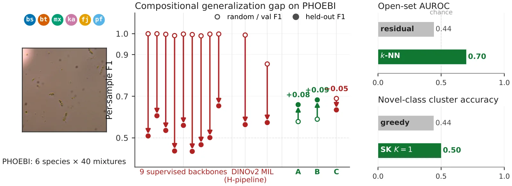
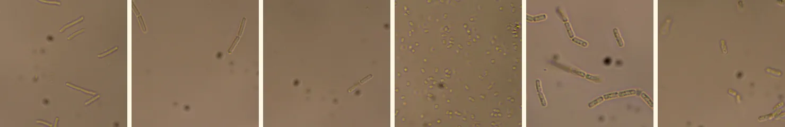

# PHOEBI

<p align="center">
  <a href="https://phoebi-benchmark.vercel.app"></a>
  <a href="https://arxiv.org/abs/2606.22890"></a>
  <a href="https://huggingface.co/datasets/sochastic/PHOEBI"></a>
  <a href="LICENSE"></a>
</p>

<p align="center"></p>

Code for [*PHOEBI: An Open-World Benchmark for Multi-Label Bacterial Identification in Phase-Contrast Microscopy*](https://arxiv.org/abs/2606.22890) (NeurIPS 2026, Track on Evaluations and Datasets): the three decoders, every baseline, and the drivers and batch scripts behind each result in the paper. The dataset, with its species, splits and evaluation protocols, is described on its card at [huggingface.co/datasets/sochastic/PHOEBI](https://huggingface.co/datasets/sochastic/PHOEBI).

## Setup

```bash
conda env create -f environment.yml && conda activate phoebi
python tools/fetch_dataset.py        # data/images/ (120,000 images, about 13 GB) and the manifests in data/
```

`--subset all` also fetches the four-species subset into `data/images_4class/`. Some pretrained encoders are gated on Hugging Face, UNI and Prov-GigaPath among them: accept their terms on the model page and run `hf auth login` before running the scripts that use them.

<p align="center"></p>

From left: *B. subtilis*, *B. thermoamylovorans*, *F. johnsoniae*, *K. aerogenes*, *M. xanthus* and *P. fluorescens*, each a crop of an image from the dataset.

## Decoders

Each image is corrected for uneven illumination (divided by a Gaussian-blurred copy of itself, σ = 64), cut into a 4 × 4 grid of 224 px tiles, and embedded by a frozen DINOv2-S/14. A decoder scores every tile, and the image's prediction is the mean over its tiles.

| Module | Decoder | Mechanism |
|---|---|---|
| `src/simplex_unmixing/` | SimplexUnmix | sparsemax projection onto a simplex of learned species prototypes |
| `src/prototype_matching/` | ProtoMatch | cosine similarity to pure-culture prototypes with calibrated thresholds; closed form |
| `src/mc_channel/` | ChannelGroup | a 390-parameter head over six 64-channel groups of the embedding |

Train on the random split and score its test set:

```bash
python -m src.simplex_unmixing.train --epochs 30
python -m src.prototype_matching.train
python -m src.mc_channel.train

python experiments/run_presence_detection.py --method simplex   --model_dir outputs/simplex_unmixing/default
python experiments/run_presence_detection.py --method prototype --model_dir outputs/prototype_matching/default
python -m src.mc_channel.test_eval --model_dir outputs/mc_channel/default
```

Features are extracted on first use and cached in the run directory, keyed on the image list, tiling, backbone and illumination settings. A run with the same key can reuse another run's cache (copy or hardlink it) instead of re-extracting.

## Reproducing the paper

`slurm/` holds the batch scripts that produced the paper's results. They carry the partition, GPU and time limits of the cluster the paper was run on, so adjust those lines for another site.

| Result | Command |
|---|---|
| Decoders, random split | the commands above, or `sbatch slurm/run_methods_abc.sh` |
| Decoders under leave-combinations-out (LCO), three partitions | `sbatch slurm/run_lco.sh` (seed 1337) and `sbatch slurm/run_lco_extra_seeds.sh` (1338, 1339), then `python experiments/aggregate_seeds.py` |
| Initialisation-only decoders | `sbatch slurm/run_phoebi_initonly.sh` |
| F1 by combination order | `python experiments/run_per_order_breakdown.py` |
| Fine-tuned baselines, random split and LCO | `python tools/downscale_augmented.py` (writes `data/images_256`), then `sbatch slurm/run_supervised_baselines.sh`: nine backbones, DINOv2 through the decoder pipeline, attention-MIL |
| Four-species replication | see below |
| Frozen-encoder probe, 13 backbones | `sbatch slurm/run_encoder_probe.sh` |
| Encoder capacity under LCO | `sbatch slurm/run_backbone_swap_lco.sh` |
| Open-set detection, scoring functions and novel-class discovery, leave-one-species-out | `sbatch slurm/run_loocv.sh`; `python experiments/run_knn_fpr_tpr_sweep.py` reuses its features; discovery comparators with `sbatch slurm/run_ncd_comparators.sh` |
| Projection, tile-size and tile-count ablations | `ABL_SWEEP=<projection, tile_size or tile_count> sbatch slurm/run_ablation_sweep.sh`; ChannelGroup's tile count with `python experiments/run_tile_count_method_c.py --model_dir outputs/mc_channel/default` |
| Acquisition-robustness battery and label-noise bound | `sbatch slurm/run_acquisition_robustness.sh` |
| Matched illumination arms | `sbatch slurm/run_none_illum_models.sh`, then `slurm/run_acquisition_robustness.sh` again with `ACQ_ILLUMINATIONS=none`, a fresh `ACQ_OUT`, and `ACQ_SIMPLEX_DIR`, `ACQ_PROTO_DIR`, `ACQ_MC_DIR` pointed at the three `none_illum` runs |
| Grayscale control | `python experiments/run_grayscale_ablation.py` |
| Rotation and flip invariance | `sbatch slurm/run_invariance_ablation.sh` |
| Calibration, isotonic recalibration, learned temperature, prototype repulsion, boundary tiles | `sbatch slurm/run_supplementary.sh` |
| Development folds and combination-level intervals | `python tools/build_lco_dev_folds.py` (regenerates `data/lco_dev_folds.json`), then `python experiments/run_comp_nested_cv.py`; the procedure is in `experiments/LCO_DEV_PROTOCOL.md` |
| Finer units, learned subspaces and mosaic coverage | `sbatch slurm/run_comp_chain.sh` |
| Open-set variant sweep | `python experiments/run_comp_openworld.py` |

The four-species replication runs both fine-tuning baselines on the four-species subset, for each of the nine backbones of `slurm/run_supervised_baselines.sh`:

```bash
python tools/fetch_dataset.py --subset phoebi4
python tools/downscale_augmented.py --input_dir data/images_4class --output_dir data/images_4class_256
python baselines/supervised_multilabel.py --frames_dir data/images_4class_256 --epochs 5 --lr 1e-4 \
    --backbone resnet50.a1_in1k --output_dir outputs/supervised_multilabel_4class/resnet50
python baselines/supervised_multilabel_heldout.py --frames_dir data/images_4class_256 --epochs 5 --lr 1e-4 \
    --heldout_counts 1:1,2:2,3:1,4:1 \
    --backbone resnet50.a1_in1k --output_dir outputs/supervised_multilabel_4class_heldout/resnet50
```

## Layout

```
src/common/         illumination correction, tiling, frozen features, prototypes, metrics, split loading
src/<decoder>/      simplex_unmixing, prototype_matching, mc_channel
src/compositional/  units, development protocol, scoring and intervals for the compositional analyses
experiments/        drivers for every result above
baselines/          fine-tuned classifiers, attention-MIL, frozen-encoder probes
tools/              dataset fetch, splits and development folds, and the scripts that cut the released images from video frames
slurm/              batch scripts
website/            the project page (Next.js, deployed on Vercel)
```

## Citation

```bibtex
@inproceedings{baranwal2026phoebi,
  title         = {{PHOEBI}: An Open-World Benchmark for Multi-Label Bacterial Identification in Phase-Contrast Microscopy},
  author        = {Baranwal, Aaditya and Hasan, Md Jahid and Vyas, Shruti},
  booktitle     = {Advances in Neural Information Processing Systems (NeurIPS), Track on Evaluations and Datasets},
  year          = {2026},
  eprint        = {2606.22890},
  archivePrefix = {arXiv},
  primaryClass  = {cs.CV}
}
```

Code under the MIT licence (`LICENSE`); the dataset under CC BY 4.0.
